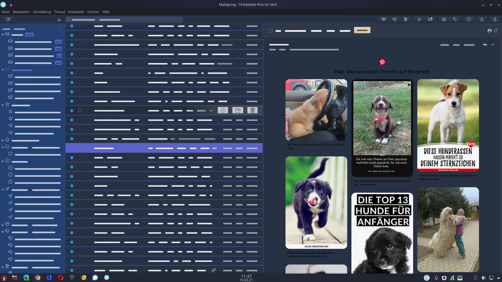

# Blue-Mailspring-Theme

Blue-Mailspring-Theme 
A fresher dark theme inspired by KDE-Plasma Themes 
Summary 
📍 A fresher dark theme inspired by the KDE-Plasma Desktop Environment Theme Inspired with a splash of green and red colors
💻 Easy to install into Mailspring
🎉 Open source 

How to install the theme into Mailspring 

1.Download the zip file by clicking on the green Clone or download button at the top right of the repo.
2.Unzip the file that was downloaded into one folder of your choise.
3.Open Mailspring
4.Open the Mailspring menu EDIT of Mailspring
5.Click on Install Theme... in the Mailspring menu
6.Find the Blue-Mailspring-Theme folder and click on it
7.Click the blue choose button and the theme will load
8.A Popup will shown up if you’re done 🎉 

License 
Licensed under the Mailsping-Theme-Starter by Foundry 376, LLC 
I hope you like the theme and share with some friends. 
“https://github.com/hanny00?tab=repositories
